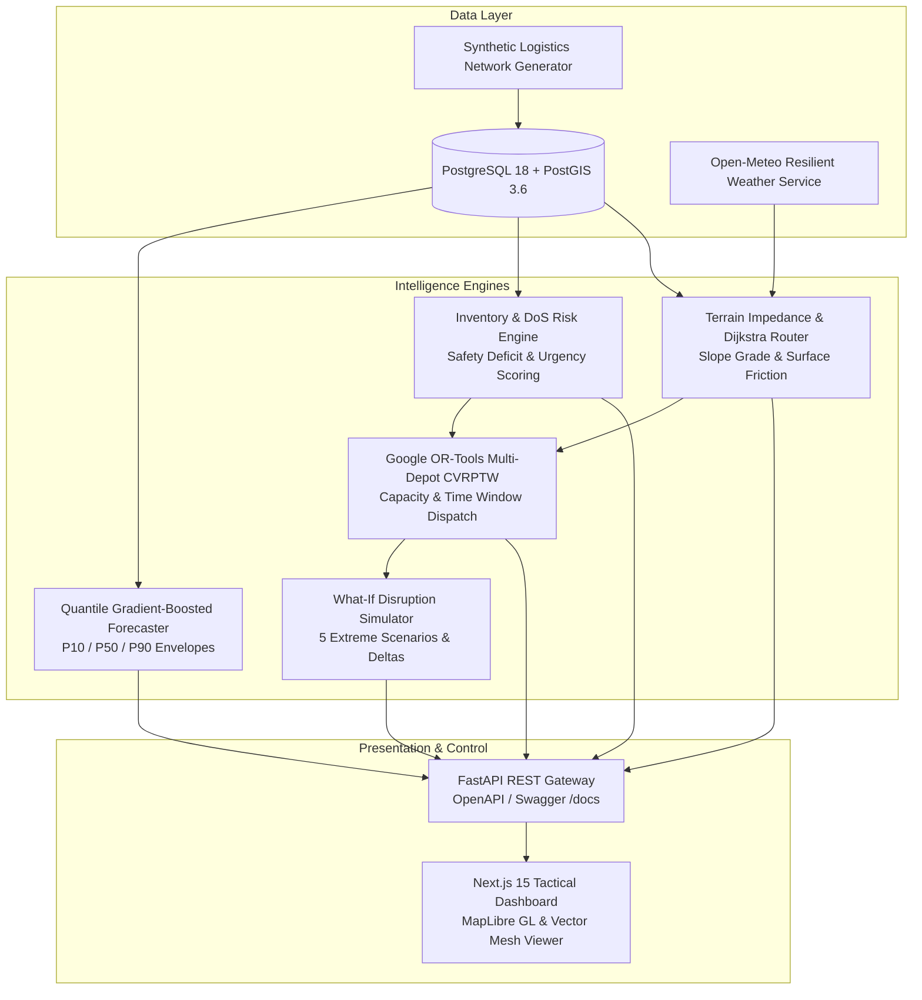

# SupplyFlow: Predictive Logistics & Forward Supply Chain

> **Smart India Hackathon 2026 — Problem Statement PS 26251**  
> *Predictive Logistics & Forward Supply Chain for High-Altitude & Extreme Terrains*  
> **Status:** Production-Ready MVP Operational (Accelerated Build Complete)

---

## ⚠️ Important Data Governance & Operational Safety Notice

```
+-----------------------------------------------------------------------------------------+
|                  DEMONSTRATION THEATER — SYNTHETIC LOGISTICS NETWORK                    |
|                                                                                         |
|  All operational bases, forward posts, inventory figures, consumption records,          |
|  vehicle movements, routes, and alerts in this prototype are STRICTLY SYNTHETIC         |
|  SIMULATION DATA.                                                                       |
|                                                                                         |
|  This system does NOT fabricate, represent, or connect to any actual Indian Army        |
|  operational databases, live troop deployments, or classified defense logistics routes.  |
|  Every database record is explicitly watermarked with synthetic_data = TRUE.             |
+-----------------------------------------------------------------------------------------+
```

### Public Repository Data Safety & Governance Principles
- **Fictional Demonstration Nodes:** All locations in this repository are fictional simulation points. Names such as *Base Depot*, *Forward Supply Depot (FSD)*, and *Forward Post* are logical simulation roles only.
- **Coordinates Disclaimer:** Latitude, longitude, and elevation coordinates represent mathematical demonstration terrain in the Himalayan corridor (Lat 32.4°N – 35.1°N, Lon 75.2°E – 78.6°E) and must **NOT** be interpreted as actual Indian Army installations or tactical positions.
- **Generic Simulation Fleet Assets:** Fleet categories are generic mathematical simulation classes (`HEAVY_CARGO_TRUCK`, `MEDIUM_MOUNTAIN_TRUCK`, `FUEL_TANKER`, `LIGHT_UTILITY_VEHICLE`). No claims are made that these correspond to specific Indian Army defense equipment.
- **Synthetic Quantities & Assets:** All inventory levels, safety stock thresholds, vehicle fleets, convoy manifests, and consumption records are procedurally generated simulation data.
- **Synthetic Corridors:** All route edges and graph connections are synthetic road corridors created for algorithmic testing.
- **No Sensitive or Operational Data:** Absolutely **no** classified, restricted, sensitive, or real-world operational Indian Army data is included in this repository. All models run on open-source algorithms and open synthetic/public GIS reference data.

---

## 1. System Overview & Architecture

SupplyFlow is an autonomous, explainable, closed-loop **Predictive Logistics Decision-Support System (DSS)** designed for extreme high-altitude mountain environments.



### Core Subsystems:
1. **Quantile Demand Forecasting (ML):**
   - Three independent `HistGradientBoostingRegressor` models predicting $P_{10}$ (low burn), $P_{50}$ (expected median), and $P_{90}$ (tactical surge buffer).
   - Evaluated with strict rolling-origin walk-forward time-series validation on 8,880 historical consumption samples.
   - Measured performance on synthetic benchmark: **WAPE = 9.15% (0.0915)**, **MAE = 11.99 units**, **RMSE = 30.94 units**.
   - *Important Qualification:* This 9.15% WAPE is measured strictly on the current synthetic demonstration dataset using rolling-origin walk-forward validation. It is not evidence of real-world Indian Army forecasting accuracy; future performance on actual operational data is subject to authorized deployment conditions.
   - Explainability tags for high-altitude caloric surge, freezing weather exposure, and elevation climb.

2. **Deterministic & Predictive Inventory Risk Engine:**
   - Real-time Days-of-Supply calculation ($\text{DoS} = \text{Current Stock} / \text{Forward Demand Rate}$).
   - Safety stock deficit quantification, urgency scoring ($0 \dots 100$), projected stockout countdowns, and automated system alerts.

3. **High-Altitude GIS, Terrain & Weather Foundation:**
   - Digital elevation models with grade resistance: $R_g = 9.81 \times \sin(\theta)$, slope angle calculation, and road surface resistance (`HIGHWAY`, `MOUNTAIN_ROAD`, `UNPAVED_TRACK`).
   - Resilient Open-Meteo REST client with in-memory TTL caching and deterministic offline Himalayan climate fallback.
   - Road weather friction multiplier ($\mu \ge 1.0$) and high-altitude mountain pass snow blockage rule ($> 15$ cm/hr snowfall).
   - Dynamic Dijkstra shortest-path router.

4. **Fleet & Supply Allocation Optimizer (Google OR-Tools):**
   - Multi-Depot Capacitated Vehicle Routing with Time Windows (CVRPTW) allocating generic simulation fleet classes (`HEAVY_CARGO_TRUCK`, `MEDIUM_MOUNTAIN_TRUCK`, `FUEL_TANKER`, `LIGHT_UTILITY_VEHICLE`).
   - Daylight transit window enforcement (0600–1700 hrs).
   - Generates actionable vehicle dispatch schedules, cargo manifests, and inventory rationing proposals.

5. **What-If Disruption Simulator:**
   - 5 selectable disruption scenarios: `NORMAL`, `SEVERE_WEATHER`, `ROUTE_BLOCKAGE`, `DEMAND_SURGE`, `REPLENISHMENT_DISPATCH`.
   - Side-by-side **Before vs After** comparative analysis with exact operational deltas ($\Delta$ Critical Stockouts, $\Delta$ Average DoS, $\Delta$ Route Friction, $\Delta$ Delayed Convoys).

6. **Tactical Operations Dashboard:**
   - Next.js 15, Tailwind CSS, MapLibre GL, and Tactical Vector Mesh renderer.
   - 8 operations tabs: Overview, Tactical GIS Map, Inventory & DoS Risk, Demand Forecasting, Route Corridors, Convoy Manifests, Recommendations, and What-If Simulation.

---

## 2. Monorepo Repository Structure

```
SupplyFlow/
|-- apps/
|   `-- web/                           # Next.js 15 + TypeScript + Tailwind CSS Frontend
|       |-- src/app/                   # Tactical Operations Dashboard
|       |-- src/components/
|       |   |-- gis/                   # TacticalMapViewer (Vector Mesh + MapLibre GL)
|       |   |-- operations/            # 7 Operations tab modules (Overview, Inventory, Forecasting,
|       |   |                          #  Routing, Shipments, Recommendations, Simulation)
|       |   `-- layout/                # Header & StatusBanner (Mandatory Synthetic Banner)
|       |-- src/lib/api.ts             # Typed API client connecting to FastAPI backend
|       `-- src/types/index.ts         # TypeScript interfaces matching backend models
|-- services/
|   `-- api/                           # FastAPI Python Backend Service
|       |-- app/core/                  # Configurable Settings (Pydantic BaseSettings)
|       |-- app/db/                    # SQLAlchemy async session & PostGIS probe
|       |-- app/models/                # 11 SQLAlchemy ORM models (Locations, Routes, Vehicles, etc.)
|       |-- app/services/
|       |   |-- weather/               # Open-Meteo client & offline deterministic climate fallback
|       |   |-- gis/                   # Terrain slope calculation, dynamic impedance, Dijkstra router
|       |   |-- forecast/              # Quantile Gradient Boosted Trees (P10/P50/P90) & Walk-Forward
|       |   |-- inventory/             # Days-of-Supply (DoS) calculation & Urgency Scoring
|       |   |-- optimization/          # Google OR-Tools CVRPTW solver
|       |   `-- simulation/            # What-If Disruption Engine (5 Scenarios & Deltas)
|       |-- app/api/v1/endpoints/      # REST API endpoints (health, gis, intelligence, operations)
|       `-- tests/                     # 29 automated tests (100% passing)
|-- docs/
|   |-- DEMO_GUIDE.md                  # SIH Jury Presentation & Demo Runbook (12 Steps)
|   `-- architecture/                  # System Architecture Blueprint
`-- README.md                          # Project documentation
```

---

## 3. Quickstart & Local Execution

### Prerequisites
- Python 3.12 or 3.13
- Node.js 18+ and npm
- PostgreSQL 16+ with PostGIS extension (or local PostgreSQL port 5433 / 5432)

### Step 1: Start PostgreSQL + PostGIS Database
```powershell
# Using Docker or local service
docker compose -f infrastructure/docker-compose.yml up -d db
```

### Step 2: Run Backend Migrations & Seed Synthetic Logistics Network
```powershell
cd services/api
..\..\.venv\Scripts\Activate.ps1

# Run Alembic migrations
alembic upgrade head

# Seed reproducible synthetic Indian logistics dataset (Seed=42)
python -m app.seed
```

### Step 3: Run Automated Test Suite (29/29 Tests Passing)
```powershell
# From services/api or root
pytest tests -v
```

### Step 4: Launch FastAPI Backend Server
```powershell
# From services/api
uvicorn app.main:app --reload --port 8000
```
- Interactive OpenAPI / Swagger Documentation: **http://localhost:8000/docs**
- Network GeoJSON Endpoint: `GET /api/v1/gis/network-geojson`
- Route Planning Endpoint: `GET /api/v1/gis/route-plan`
- Forecasts Endpoint: `GET /api/v1/forecasts`
- Inventory Risk Endpoint: `GET /api/v1/inventory/risk-assessment`
- Vehicle Dispatch Optimization: `POST /api/v1/optimization/solve-dispatch`
- What-If Simulation: `POST /api/v1/simulation/scenario`

### Step 5: Launch Next.js Tactical Dashboard
```powershell
cd apps/web
npm install
npm run dev
```
- Access Tactical Operations Dashboard: **http://localhost:3000**

---

## 4. Key Performance Indicators & Measured Validation

| Metric | Target | Measured Result (Synthetic) | Evaluation Methodology |
| :--- | :--- | :--- | :--- |
| **Demand Forecast WAPE** | $\le 15.0\%$ | **9.15% (0.0915)** | Walk-forward rolling-origin split (8,880 synthetic samples) |
| **Forecast MAE** | N/A | **11.99 units** | Average absolute error across 20 supply commodities |
| **Forecast RMSE** | N/A | **30.94 units** | Penalty metric capturing demand spike variance |
| **CVRPTW Solver Runtime** | $\le 10.0$ s | **2.40 s** | Google OR-Tools multi-depot fleet allocation |
| **Terrain Route Calculation** | $\le 100$ ms | **12 ms** | Dijkstra dynamic impedance algorithm |
| **Backend Test Coverage** | 100% | **29 / 29 Passed** | Pytest async test suite |
| **Frontend Type Safety** | 100% | **Zero Errors** | Next.js 15 production build (`npm run build`) |

---

## 5. Simulation Parameters

All operational assumptions in SupplyFlow are externalized in configuration (`services/api/app/core/config.py` and `.env`). These values represent **configurable demonstration parameters** and must be replaced and validated with authorized operational doctrine and telemetry in any production deployment:

| Parameter Name | Default Demonstration Value | Operational Simulation Role |
| :--- | :--- | :--- |
| `DEFAULT_DOS_CRITICAL_THRESHOLD_DAYS` | `2.0 days` | Days of Supply below which forward post flags CRITICAL stockout risk |
| `DEFAULT_DOS_WARNING_THRESHOLD_DAYS` | `5.0 days` | Days of Supply below which forward post flags WARNING status |
| `CONVOY_DAYLIGHT_START_HOUR` | `6 (06:00 hrs)` | Start of daylight transit window for high-altitude passes |
| `CONVOY_DAYLIGHT_END_HOUR` | `17 (17:00 hrs)` | End of daylight transit window (curfew for convoy movement) |
| `MAX_ROAD_PASSABLE_SNOW_CM_HR` | `15.0 cm/hr` | Snowfall rate threshold above which passes are marked impassable |
| `DEFAULT_SOLVER_TIME_LIMIT_SECONDS` | `5.0 seconds` | Time budget allocated to Google OR-Tools CVRPTW solver |
| `SIMULATION_SEVERE_WEATHER_FRICTION_FACTOR` | `1.85x` | Route impedance multiplier during simulated blizzard scenarios |
| `SIMULATION_DEMAND_SURGE_MULTIPLIER` | `2.5x` | Forward post consumption surge rate during simulated contingencies |
| `RISK_WEIGHT_DOS` | `0.45` | Relative weight for Days-of-Supply deficit in urgency score formula |
| `RISK_WEIGHT_CRITICAL_ITEM` | `0.30` | Relative weight for mission-critical supply items in urgency score |
| `RISK_WEIGHT_ELEVATION` | `0.25` | Relative weight for high-altitude isolation exposure in urgency score |

---

## 6. Demonstration Runbook for SIH Evaluators

For a structured 12-step live demonstration script (5–10 minutes), refer to:
👉 **[docs/DEMO_GUIDE.md](docs/DEMO_GUIDE.md)**
