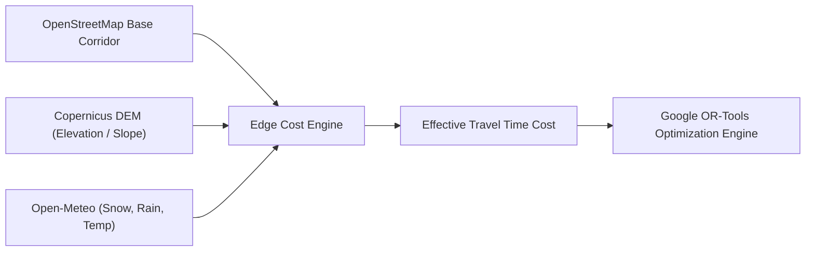
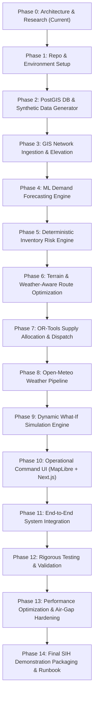

# SupplyFlow: System Architecture & Engineering Blueprint
**Smart India Hackathon 2026 — Problem Statement PS 26251**  
*Predictive Logistics & Forward Supply Chain for the Indian Army*  
**Document Phase:** Phase 0 — Discovery, Architecture, Data-Source & Technology Specification  
**Version:** 1.0.0-PROPOSAL  
**Author:** Lead Systems Architect & Engineering Team  

---

## 1. Executive Summary & Problem Translation

### 1.1 Problem Statement Deconstruction (PS 26251)
Military logistics in contested, high-altitude, and extreme geographical operating environments (such as Northern and Eastern Command sectors) face compounding supply-chain vulnerabilities:
- **Severe Environmental Friction:** Mountain passes (*la*s), sub-zero temperatures, monsoon landslides, and rapid weather shifts render nominal road transit times volatile and unpredictable.
- **Asymmetric Lead Times & Bottlenecks:** A supply run that takes 4 hours in dry weather may take 36 hours or become impassable during a blizzard or landslide, turning a comfortable 5-day safety stock into a critical stockout.
- **Multi-Echelon Asset Constraints:** Limited specialized transport assets (4x4 high-mobility trucks, heavy transport, aerial lift assets) must service competing demands across Corps Depots, Forward Supply Depots (FSD), Brigade Maintenance Areas (BMA), and forward Operating Bases/Posts (OP).
- **Static vs. Dynamic Planning Gap:** Conventional military supply planning relies heavily on static scales of ration, ammunition, and fuel reserves (Days of Maintenance / Reserves). When consumption spikes dynamically (tactical maneuvers, severe winter heating fuel surges, medical contingencies), planners lack predictive lead-time warnings until stocks drop below critical thresholds.

### 1.2 The SupplyFlow Engineering Mandate
SupplyFlow is **not** an inventory CRUD database with a map widget and a generative text chatbot.  
SupplyFlow is an **autonomous, explainable, closed-loop Predictive Logistics Decision-Support System (DSS)** that binds together five mathematical engines:
1. **Predictive Consumption Forecaster (ML):** Anticipates item-level forward demand considering operational rhythm, weather forecasts, and historical trends.
2. **Deterministic & Predictive Inventory Risk Engine:** Computes dynamic days-of-supply, safety-stock deficits, and lead-time-sensitive stockout dates.
3. **Terrain & Weather-Aware GIS Network Engine:** Dynamically re-weights road networks based on real elevation gradients, slope resistance, and real-time precipitation/snowfall.
4. **Constrained Fleet & Supply Allocation Optimizer (OR):** Solves multi-depot, multi-echelon Capacitated Vehicle Routing with Time Windows (CVRPTW) and priority replenishment rationing.
5. **Interactive What-If Simulation Engine:** Enables logistics planners to stress-test supply chains against weather shocks, route interdictions, fleet losses, and surge demands before dispatching convoys.

---

## 2. Responsible Military Logistics & Data Governance

### 2.1 The Cardinal Data Governance Rule
> **Zero Fabrication Policy:** Under no circumstances will SupplyFlow fabricate real Indian Army unit designations, actual troop numbers, operational supply depots, classified road networks, or live strategic inventory counts.
> All operational locations, inventory levels, consumption histories, fleet distributions, routes, and logistics events in this prototype are strictly synthetic simulation constructs.

### 2.2 Demonstration Theater Labeling
The demonstration geographic theater is strictly designated and visually badged on all screens and outputs as:
> **"DEMONSTRATION THEATER — SYNTHETIC LOGISTICS NETWORK"**
Under no circumstances shall any user interface, documentation, or code comment imply that any displayed node or route represents an actual Indian Army military deployment, tactical post, or classified defense corridor.

### 2.3 Data Ingestion Architecture & Demonstration Stratification
To ensure absolute compliance with Indian National Defense security regulations while delivering a demonstration-ready hackathon platform:

```
+-----------------------------------------------------------------------------------------+
|                                DATA GOVERNANCE BOUNDARY                                 |
+-----------------------------------------------------------------------------------------+
| [LAYER A: Free Public Open Data]                                                        |
|   - OpenStreetMap (OSM) public highways & road classifications                          |
|   - Copernicus DEM GLO-30 / SRTM 30m Digital Elevation Models (public domain)           |
|   - Open-Meteo Meteorological APIs & Reanalysis (CC BY 4.0, zero-auth)                  |
+-----------------------------------------------------------------------------------------+
| [LAYER B: Explicitly Labeled "Synthetic / Simulation Data" (SIH Demo Layer)]            |
|   - Demonstration Banner: "DEMONSTRATION THEATER — SYNTHETIC LOGISTICS NETWORK"         |
|   - Nodes: Labeled as "Synthetic Logistics Hub Alpha (Base Depot)", "FSD North-1", etc. |
|   - Items: Standardized NATO/Indian defence supply classes (Class I Ration,             |
|     Class III POL - Fuel, Class V Ammo, Class VIII Medical, Class IX Spares)            |
|   - Demands: Mathematically synthesized Poisson/Gaussian consumption with seasonal/     |
|     weather covariance                                                                  |
|   - Metadata Header on every API response & UI screen: `[SYNTHETIC / SIMULATION DATA]`  |
+-----------------------------------------------------------------------------------------+
| [LAYER C: Secure Ingestion Abstraction Layer (Production Ready Plug-in)]                |
|   - Schema-compliant REST / Parquet / GeoPackage ingest interfaces                      |
|   - Isolated air-gapped ETL pipeline ready to connect to secure military inventory      |
|     databases (e.g., CICP / ILMS equivalent) in authorized environments                 |
+-----------------------------------------------------------------------------------------+
```

---

## 3. Technology Stack Selection & Verification

Every proposed technology has been selected according to strict criteria:
- **100% Free & Open Source:** Zero paid SaaS, zero proprietary map services (no Google Maps API fees), zero required proprietary AI API keys.
- **Windows Local Dev & Docker Container Compatibility:** Verified binary wheel support for Python 3.11, Docker Desktop compatibility.
- **Stability & Active Maintenance:** Modern LTS / stable versions only.

| Domain | Technology | Verified Stable Version | License | Justification | Alternatives Considered & Rejected |
| :--- | :--- | :--- | :--- | :--- | :--- |
| **Frontend Framework** | Next.js (App Router) + React | Next.js 15.x / React 19 / 18.3 | MIT | Fast server-side rendering, robust client-side routing, high performance for high-density tables and maps. | Pure Vite+React (less unified for SSR and mock API proxying), Angular (heavier boilerplate). |
| **Frontend Language** | TypeScript | 5.6+ | Apache 2.0 | Type safety across GIS schemas, GeoJSON, and complex optimization response payloads. | JavaScript (high risk of runtime type errors with complex nested GIS/OR structures). |
| **UI Component System** | Tailwind CSS v4 / v3.4 + Radix UI / Lucide React | Radix UI primitives, Lucide 0.450+ | MIT | Utilitarian, highly responsive, zero-bloat design system. Allows high-information-density military operations styling. | Material UI (too bulky/consumer-feeling), Ant Design (heavy bundle, styling friction). |
| **GIS Map Rendering** | MapLibre GL JS | 4.7.1 / 5.0+ | BSD-3-Clause | 100% open-source fork of Mapbox GL. High-performance WebGL rendering of thousands of GeoJSON vectors, custom raster elevation, and animated convoy routes. Completely free, no API token required. | Mapbox GL JS (commercial license, requires token/billing), Leaflet (DOM-based, poor performance with >500 vector segments and 3D terrain). |
| **Backend Framework** | FastAPI (Python) | 0.115.x | MIT | High-performance asynchronous API framework, native Pydantic v2 validation, automatic OpenAPI / Swagger documentation, seamless integration with Python ML/GIS/OR libraries. | Django (overly monolithic ORM unsuitable for low-level PostGIS raster / OR-Tools workflows), Flask (lacks native async and robust auto-validation). |
| **Backend Runtime** | Python | 3.11.x (Docker / local `py -3.11`) | PSF License | Maximum wheel compatibility with geospatial binaries (GDAL, Fiona, Rasterio, Shapely) and optimization tools (OR-Tools). Python 3.14 lacks pre-built wheels on Windows. | Python 3.14 (too new, binary wheel failures on Windows for geospatial C-extensions). |
| **Relational & Spatial DB**| PostgreSQL + PostGIS | PostgreSQL 16.x + PostGIS 3.4 | PostgreSQL (Open Source) / GPL-2.0 | Gold standard for enterprise spatial queries (`ST_DWithin`, `ST_Length`, `ST_Intersection`, spatial indexing via GiST). | SQLite/SpatiaLite (insufficient concurrent connection pooling, lacks native raster/GIS maturity), MongoDB (spatial query performance inferior to PostGIS for network graphs). |
| **Database ORM & Migrations**| SQLAlchemy 2.0 + GeoAlchemy2 + Alembic | SQLAlchemy 2.0.36+, GeoAlchemy2 0.15+, Alembic 1.13+ | MIT | Type-safe declarative spatial tables, PostGIS dialect support, rock-solid schema migrations. | Tortoise ORM (lacks robust PostGIS support), Peewee (insufficient spatial tooling). |
| **Machine Learning** | scikit-learn + XGBoost + statsmodels | scikit-learn 1.5+, XGBoost 2.1+, statsmodels 0.14+ | BSD-3-Clause / Apache 2.0 | Explainable tabular and time-series modeling. Gradient boosting excels on tabular demand forecasting with lag/weather features without deep-learning black-box opacity. | PyTorch / LSTM / Transformers (overkill for supply time-series, requires massive training data, lacks instant tree-SHAP explainability, GPU dependency). |
| **GIS Data Analysis** | GeoPandas, Shapely, PyProj, Rasterio | GeoPandas 1.0+, Shapely 2.0+, Rasterio 1.4+ | BSD-3-Clause | Vector manipulation, geodesic distance computation, elevation GeoTIFF sampling, slope derivation. | PyQGIS (heavy desktop GIS dependency), ArcPy (commercial/proprietary ESRI). |
| **Graph Routing & Cost Engine** | NetworkX | 3.4+ | BSD-3-Clause | In-memory graph network manipulation. Allows dynamic edge weight adjustment (applying slope penalty, weather friction multiplier, and road-cut closures) in microseconds. | OSRM backend alone (difficult to dynamically alter edge friction based on hourly rainfall without rebuilding the contraction hierarchy). |
| **Constrained Optimization**| Google OR-Tools | 9.11+ / 9.12+ | Apache 2.0 | World-class vehicle routing solver (CVRPTW, multi-depot, capacity constraints, delivery priorities, soft/hard time windows). | PuLP / SciPy linprog (cannot easily model multi-vehicle combinatorial routing), OptaPlanner (Java-based, adds heavy JVM bridge overhead). |
| **Containerization** | Docker & Docker Compose | Docker Engine 27+ / Compose v2 | Apache 2.0 | One-command orchestration of PostGIS, FastAPI backend, Next.js frontend, and local routing services. | Bare-metal manual setup (error-prone GDAL/PostGIS setup across different developer OS environments). |

---

## 4. Free External Data Sources & Rigorous Feasibility Evaluation

| Data Source | Content Provided | License | Access Method | Auth Required | Rate Limits | Viability for SIH Demo & Offline Resilience |
| :--- | :--- | :--- | :--- | :--- | :--- | :--- |
| **Open-Meteo Forecast & Archive API** | Hourly precipitation, temperature, snowfall, wind speed, visibility, weather codes, elevation | CC BY 4.0 | REST API (`https://api.open-meteo.com/v1/forecast`) | **NO** (Zero key) | 10,000 calls/day, 600/min per IP | **100% Viable.** Free for non-commercial/academic use. Includes a local fallback caching mechanism in SupplyFlow to guarantee offline presentation without internet. |
| **Copernicus DEM (GLO-30) / SRTM 30m** | 30-meter ground resolution digital elevation raster (GeoTIFF) | Public Domain / Open Access | Direct download of regional tiles (.tif) bundled in repo `data/terrain/` | **NO** | Local file access (zero network calls) | **100% Viable & Air-Gapped.** Pre-clipped demonstration tiles covering mountainous Himalayan / border terrain stored locally; elevation & slope extracted locally via `rasterio`. Zero internet latency during demo. |
| **OpenStreetMap (OSM) via Geofabrik / Overpass** | Road network geometries, surface type (`paved`, `unpaved`, `ground`), road classifications (`primary`, `secondary`, `track`) | ODbL (Open Database License) | Pre-extracted GeoJSON / GeoPackage / OSM PBF | **NO** | Local file access after ingestion | **100% Viable.** Extracted road corridors stored directly in PostGIS spatial tables. Real terrain geometry, zero recurring API dependence. |
| **Base Map Vector/Raster Tiles** | Topographic and dark tactical base maps | OpenStreetMap contributors / CartoDB / Stamen / Protomaps | Tile URL template (CartoDB Dark Matter / Positron / OSM Standard) | **NO** | Standard free web usage; can be cached locally or served via PMTiles offline | **100% Viable.** High visual clarity, zero paid tokens, beautiful dark/tactical military styling. |

---

## 5. System Architecture & Modular Decomposition

SupplyFlow is architected with strict separation of concerns into **seven decoupled functional subsystems**:

```
+---------------------------------------------------------------------------------------------------------+
|                                     SUPPLYFLOW ARCHITECTURE OVERVIEW                                     |
+---------------------------------------------------------------------------------------------------------+
|                                                                                                         |
|   +-------------------------------------------------------------------------------------------------+   |
|   |                         OPERATIONAL COMMAND DASHBOARD (Next.js 15 + MapLibre GL)               |   |
|   |  - Unified Tactical Map (Layers: Depots, Forward Posts, Fleet, Weather, Alert Overlays, Routes)|   |
|   |  - Supply Health & Days-of-Supply Monitor    - Interactive What-If Scenario Builder             |   |
|   |  - Automated Replenishment Dispatch Console  - Mathematical Explainability Audit Drawer         |   |
|   +-------------------------------------------------------------------------------------------------+   |
|                                                  | REST / WebSocket                                     |
|                                                  v                                                      |
|   +-------------------------------------------------------------------------------------------------+   |
|   |                            FASTAPI APPLICATION GATEWAY & CONTROLLER                             |   |
|   |  /api/v1/inventory    /api/v1/forecast    /api/v1/risk    /api/v1/routes    /api/v1/simulation  |   |
|   +-------------------------------------------------------------------------------------------------+   |
|          |                    |                     |                     |                    |        |
|          v                    v                     v                     v                    v        |
|   +---------------+   +---------------+     +---------------+     +---------------+    +--------------+ |
|   | MODULE 1:     |   | MODULE 2:     |     | MODULE 3:     |     | MODULE 4:     |    | MODULE 5:    | |
|   | DEMAND ML     |   | INVENTORY RISK|     | TERRAIN &     |     | CONSTRAINED   |    | DYNAMIC      | |
|   | ENGINE        |   | ENGINE        |     | WEATHER GIS   |     | OPTIMIZER     |    | SIMULATION   | |
|   | - Baseline    |   | - Dynamic DoS |     | - GeoTIFF DEM |     | - OR-Tools    |    | - Synthetic  | |
|   |   (SMA/EMA)   |   | - Safety Stock|     |   Slope Calc  |     |   CVRPTW      |    |   Generator  | |
|   | - XGBoost     |   | - Stockout    |     | - Weather edge|     | - Multi-Depot |    | - What-If    | |
|   |   Multi-step  |   |   Date Predict|     |   friction    |     |   Allocation  |    |   Disruption | |
|   | - TreeSHAP    |   | - Determin-   |     | - NetworkX    |     | - Capacity &  |    |   Chamber    | |
|   |   attribution |   |   istic alerts|     |   Dynamic Cost|     |   Priority    |    | - Event Loop | |
|   +---------------+   +---------------+     +---------------+     +---------------+    +--------------+ |
|          \                    |                     |                     /                    /        |
|           -------------------------------------------------------------------------------------         |
|                                                  |                                                      |
|                                                  v                                                      |
|   +-------------------------------------------------------------------------------------------------+   |
|   |                    PERSISTENCE & SPATIAL DATA LAYER (PostgreSQL 16 + PostGIS 3.4)               |   |
|   |  - Spatial: nodes (depots/posts), edges (routes, terrain corridors), active shipments           |   |
|   |  - Tabular: items, inventory, transactions, forecasts, vehicle fleet, optimization runs, alerts  |   |
|   +-------------------------------------------------------------------------------------------------+   |
|                                                                                                         |
+---------------------------------------------------------------------------------------------------------+
```

---

## 6. Comprehensive Database Architecture (PostgreSQL + PostGIS)

### 6.1 Entity-Relationship (ER) Schema Overview
The relational-spatial model is designed for 3NF normalized transactional integrity, with indexed spatial types (`GEOMETRY(Point, 4326)` and `GEOMETRY(LineString, 4326)`).

```mermaid
erDiagram
    LOCATION ||--o{ INVENTORY : holds
    LOCATION ||--o{ VEHICLE : stationed_at
    LOCATION ||--o{ DEMAND_FORECAST : forecasts_for
    LOCATION ||--o{ ALERT : triggers
    SUPPLY_ITEM ||--o{ INVENTORY : cataloged_as
    SUPPLY_ITEM ||--o{ CONSUMPTION_RECORD : consumed
    SUPPLY_ITEM ||--o{ DEMAND_FORECAST : predicted_item
    SUPPLY_ITEM ||--o{ SHIPMENT_ITEM : loaded_in
    ROUTE_EDGE ||--o{ SHIPMENT : traverses
    VEHICLE ||--o{ SHIPMENT : transports
    OPTIMIZATION_RUN ||--o{ SHIPMENT : generates
    OPTIMIZATION_RUN ||--o{ RECOMMENDATION : outputs

    LOCATION {
        uuid id PK
        string code UK
        string name
        string echelon_type "BASE_DEPOT | FSD | BMA | FORWARD_POST"
        geometry coordinates "POINT(4326)"
        float elevation_m
        boolean is_active
        boolean is_synthetic
    }

    SUPPLY_ITEM {
        uuid id PK
        string sku UK
        string name
        string supply_class "CLASS_I_RATIONS | CLASS_III_POL | CLASS_V_AMMO | CLASS_VIII_MED | CLASS_IX_SPARES"
        string unit_of_measure "KG | LITERS | ROUNDS | BOXES"
        float unit_weight_kg
        float unit_volume_m3
        float shelf_life_days
        boolean is_critical
    }

    INVENTORY {
        uuid id PK
        uuid location_id FK
        uuid item_id FK
        float current_stock
        float reserved_stock
        float safety_stock_min
        float max_capacity
        datetime last_updated
    }

    CONSUMPTION_RECORD {
        uuid id PK
        uuid location_id FK
        uuid item_id FK
        datetime recorded_date
        float quantity_consumed
        float weather_temp_c
        float snowfall_cm
        string operational_tempo "ROUTINE | HEIGHTENED | WINTER_STOCKING | CONTINGENCY"
        boolean is_synthetic
    }

    DEMAND_FORECAST {
        uuid id PK
        uuid location_id FK
        uuid item_id FK
        datetime forecast_generated_at
        datetime target_date
        float predicted_demand_qty
        float lower_bound_qty
        float upper_bound_qty
        string model_version
        jsonb feature_contributions
    }

    ROUTE_EDGE {
        uuid id PK
        uuid from_location_id FK
        uuid to_location_id FK
        geometry route_geometry "LINESTRING(4326)"
        float nominal_distance_km
        float nominal_travel_time_hrs
        float average_slope_deg
        float max_elevation_m
        string road_classification "HIGHWAY | MOUNTAIN_ROAD | UNPAVED_TRACK"
        float current_friction_multiplier
        boolean is_blocked
    }

    VEHICLE {
        uuid id PK
        string vehicle_code UK
        uuid current_location_id FK
        string vehicle_type "4X4_MEDIUM_TRUCK | 6X6_HEAVY_TRUCK | SPECIALIZED_BOWSER | LIGHT_UTILITY"
        float payload_weight_capacity_kg
        float payload_volume_capacity_m3
        float max_speed_kmh
        float fuel_range_km
        string status "AVAILABLE | IN_TRANSIT | MAINTENANCE | ASSIGNED"
    }

    OPTIMIZATION_RUN {
        uuid id PK
        datetime executed_at
        string run_mode "AUTOMATIC_REPLENISHMENT | WHAT_IF_SCENARIO"
        jsonb input_constraints
        float total_travel_time_hrs
        float total_demand_satisfied_pct
        string status "OPTIMAL | FEASIBLE | INFEASIBLE"
    }

    SHIPMENT {
        uuid id PK
        uuid optimization_run_id FK
        uuid vehicle_id FK
        uuid origin_location_id FK
        uuid destination_location_id FK
        uuid route_edge_id FK
        datetime dispatch_time
        datetime estimated_arrival_time
        datetime actual_arrival_time
        string status "PLANNED | DISPATCHED | IN_TRANSIT | DELIVERED | DELAYED | BLOCKED"
        float delay_hours
        string delay_reason
    }

    ALERT {
        uuid id PK
        uuid location_id FK
        uuid item_id FK
        string severity "CRITICAL | WARNING | INFORMATIONAL"
        string alert_type "STOCKOUT_IMMINENT | LEAD_TIME_BREACH | ROUTE_BLOCKED | SURGE_DEMAND"
        float days_of_supply_remaining
        datetime projected_stockout_date
        string explanation_text
        boolean is_acknowledged
        datetime created_at
    }
```



### 6.2 Key Database Design Decisions
1. **Separation of Catalog (`SUPPLY_ITEM`) and Quantities (`INVENTORY`):** Allows tracking same military supply classes across all multi-echelon bases without redundancy.
2. **PostGIS `GEOMETRY` fields with SRID 4326 (WGS84):** Standard GPS coordinate representation, queryable via spatial distance functions (`ST_DistanceSphere`, `ST_Length`) without third-party GIS servers.
3. **Auditability of Forecasts (`DEMAND_FORECAST` with `jsonb feature_contributions`):** Stores TreeSHAP/feature impact per forecast for explainability.
4. **Edge Friction Multipliers (`ROUTE_EDGE.current_friction_multiplier`):** Weather and slope algorithms write directly to this multiplier, allowing the routing engine to adjust traversal cost dynamically.

---

## 7. Machine Learning: Demand Forecasting & Explainability

### 7.1 Objective Formulation
Predict $Y_{l, i, t+h}$, the consumption quantity of supply item $i$ at forward location $l$ for horizon $h \in \{1, 2, \dots, 14\}$ days forward.

### 7.2 Model Strategy: Justified Progression
We reject jumping straight to opaque Deep Learning (e.g., Temporal Fusion Transformers). The model architecture follows a tiered, mathematically grounded hierarchy:

```
Tier 1: Statistical Baseline (Benchmark)
   |-- 7-Day & 14-Day Simple Moving Average (SMA)
   |-- Exponential Smoothing (Holt-Winters additive trend)
   |
   V
Tier 2: Primary Machine Learning Engine
   |-- Gradient Boosted Decision Trees (XGBoost / LightGBM Regressor)
   |-- Multi-horizon recursive or direct forecasting
   |
   V
Tier 3: Explainability & Audit Layer
   |-- TreeSHAP (SHapley Additive exPlanations)
   |-- Feature contribution decomposition into human-readable rationale
```

### 7.3 Feature Engineering Matrix
1. **Autoregressive / Lag Features:** $Y_{t-1}, Y_{t-2}, Y_{t-3}, Y_{t-7}, Y_{t-14}$
2. **Rolling Statistics:** 7-day rolling mean, 7-day rolling standard deviation, 14-day rolling minimum and maximum.
3. **Calendar / Seasonal Cycles:** Day of week, day of month, month (captures winter stocking push before pass closures).
4. **Environmental Covariates (GIS/Weather):** Forecasted temperature (°C), forecasted snowfall (cm), rainfall (mm), elevation (meters above sea level).
5. **Operational Rhythm Covariates:** Operational tempo flag (`ROUTINE=1.0`, `EXERCISE=1.5`, `WINTER_BUFFER=2.2`).

### 7.4 Model Evaluation & Validation Protocol
- **Temporal Walk-Forward Validation:** Strict time-series split (Train: Days $1$ to $T-30$, Validation: Days $T-29$ to $T-15$, Test: Days $T-14$ to $T$). Zero data leakage from future timestamps.
- **Evaluation Metrics:**
  $$\text{MAE} = \frac{1}{N}\sum |Y - \hat{Y}|, \quad \text{RMSE} = \sqrt{\frac{1}{N}\sum (Y - \hat{Y})^2}, \quad \text{WAPE} = \frac{\sum |Y - \hat{Y}|}{\sum Y}$$
- **Model Selection & Benchmark Policy:**
  - The $\ge 15\%$ WAPE improvement is treated strictly as an **engineering target**, NOT a forced success criterion.
  - **No Data Manipulation:** Synthetic data, evaluation splits, and metrics must NEVER be massaged or rigged to artificially manufacture a 15% improvement.
  - The system records and reports honest, unvarnished measured performance. The model selection logic automatically selects and retains whichever validated model (statistical baseline vs. gradient boosted trees) performs better on the validation test split for that supply series.

---

## 8. Deterministic & Predictive Inventory Risk Engine

### 8.1 Mathematical Formulations
The Risk Engine operates deterministically on top of inventory counts and ML forecast outputs:

1. **Forecasted Cumulative Consumption over Horizon $H$:**
   $$C_{l, i}(H) = \sum_{t=1}^{H} \hat{Y}_{l, i, t}$$

2. **Dynamic Days of Supply ($\text{DoS}$):**
   $$\text{DoS}_{l, i} = \frac{I_{l, i}^{\text{available}}}{\bar{D}_{l, i}^{7\text{d-forecast}}}$$
   Where $I_{l, i}^{\text{available}} = \text{Current Stock} - \text{Reserved Stock}$.

3. **Dynamic Terrain-and-Weather-Adjusted Lead Time ($\widetilde{LT}$):**
   $$\widetilde{LT}_{d \to l} = LT_{\text{nominal}} \times \prod_{e \in \text{Route}(d, l)} \mu_{\text{friction}}(e)$$
   Where $\mu_{\text{friction}}(e) \ge 1.0$ accounts for road slope and weather degradation.

4. **Dynamic Safety Stock ($SS$):**
   $$SS_{l, i} = Z_{\alpha} \times \sqrt{\widetilde{LT} \cdot \sigma_D^2 + \bar{D}^2 \cdot \sigma_{LT}^2}$$
   Where $Z_{\alpha} = 2.33$ (99% military mission-critical service level for ammunition/rations).

5. **Projected Stockout Timestamp ($T_{\text{stockout}}$):**
   The earliest timestamp $t^*$ where:
   $$I_{l, i}^{\text{available}} + \sum_{\text{Shipments } s \le t^*} Q_{s, i} - \sum_{t=1}^{t^*} \hat{Y}_{l, i, t} \le 0$$

### 8.2 Explainability Synthesis Rule
Every generated alert includes a calculated natural-language explanation string:
> *"CRITICAL STOCKOUT RISK: Forward Post North-3 for Class III POL (Diesel). Available stock is 1,420 L. Predicted consumption is 540 L/day (boosted +28% due to forecasted -18°C cold wave). Depletion projected in 2.6 days. Nominal lead time is 2.0 days, but current snow friction on Rohtang corridor increases dynamic lead time to 3.8 days. Stockout is mathematically guaranteed unless expedited replenishment of 2,100 L is dispatched within 14 hours."*

---

## 9. GIS, Terrain & Weather-Aware Routing Pipeline

### 9.1 Multi-Layered Routing Cost Function
Traditional routing tools assume flat asphalt highways. In military Himalayan and border logistics, elevation change, slope steepness, and weather dramatically alter speed and fuel consumption.



### 9.2 Mathematical Formulation of Edge Friction
For every road segment edge $e = (u, v)$:
$$\text{Cost}(e) = \text{Distance}(e) \times \left( \frac{1}{V_{\text{nominal}}(e)} \right) \times \Phi_{\text{slope}}(e) \times \Omega_{\text{weather}}(e)$$

1. **Slope Resistance Factor ($\Phi_{\text{slope}}$):**
   Based on empirical heavy vehicle mountain dynamics:
   $$\Phi_{\text{slope}}(e) = 1.0 + 0.08 \cdot \max(0, \text{SlopePct}(e)) + 0.03 \cdot |\min(0, \text{SlopePct}(e))|$$
   (Steep ascents significantly penalize heavy vehicle speed; steep descents also reduce speed for heavy truck engine braking safety).

2. **Weather Friction Factor ($\Omega_{\text{weather}}$):**
   $$\Omega_{\text{weather}}(e) = 1.0 + \omega_{\text{snow}} \cdot \text{SnowRate}(\text{cm/h}) + \omega_{\text{rain}} \cdot \text{RainRate}(\text{mm/h}) + \omega_{\text{temp}} \cdot \mathbb{I}_{T < -10^{\circ}\text{C}}$$
   If snowfall exceeds 15 cm/h or a pass is flagged as blocked by landslide, $\text{Cost}(e) = \infty$ (edge pruned from graph).

### 9.3 Open-Source Routing Engine Implementation
- **Network Topology:** Extracted from OpenStreetMap highway vectors into PostGIS and held in an in-memory **NetworkX** directed graph for fast dynamic friction re-weighting.
- **Elevation Grid:** 30m Digital Elevation Model sampled along road coordinates using `rasterio` to compute exact grade angles.
- **Shortest Feasible Corridor:** Evaluated using Dijkstra / A* with dynamic weights, generating time-distance matrices fed into OR-Tools.

---

## 10. Fleet & Supply Allocation Optimization (Google OR-Tools)

### 10.1 Problem Classification
The core allocation problem is formulated as a **Multi-Depot Capacitated Vehicle Routing Problem with Time Windows and Priority Penalties (MD-CVRPTW-P)**.

### 10.2 Mathematical Objective & Configurable Parameters
Minimize total mission delivery penalty and transit time:
$$\min \left( \sum_{k \in \text{Vehicles}} \sum_{(u, v) \in \text{Edges}} c_{u, v} \cdot X_{u, v, k} + \sum_{l \in \text{Locations}} \sum_{i \in \text{Items}} P_{l, i} \cdot \text{UnmetDemand}_{l, i} \right)$$

Subject to constraints parameterized completely via configuration (never hardcoded in application code):
1. **Fleet Capacity Constraints:**
   $$\sum_{l \in \text{Route}(k)} \text{AllocatedWeight}_{l} \le \text{CapWeight}_k, \quad \sum_{l \in \text{Route}(k)} \text{AllocatedVolume}_{l} \le \text{CapVolume}_k$$
2. **Depot Inventory Availability:**
   $$\sum_{k \text{ from Depot } d} \text{LoadedQuantity}_{k, i} \le I_{d, i}^{\text{available}}$$
3. **Configurable Delivery Priority Penalties ($P_{l, i}$):**
   Priority weights, critical Days-of-Supply thresholds ($\text{DoS}_{\text{crit}}$ default $2.0$ days), and class rankings are loaded dynamically from `simulation_config.json` or database parameters.
4. **Configurable Time Window Constraints:**
   Transit windows (e.g., configurable start/end daylight hours), mountain pass closure hours, weather degradation multipliers ($\omega_{\text{snow}}, \omega_{\text{rain}}$), and vehicle fleet configurations are externalized into configuration schemas so the simulation can be modified without altering engine source code.

---

## 11. Cohesive Simulation & What-If Scenario Engine

### 11.1 Dynamic Simulation State Loop
The simulation engine runs on a discrete-time clock (hourly or daily timesteps) maintaining mathematical mass conservation:

$$I_{l, i}(t + \Delta t) = I_{l, i}(t) - \text{Consumption}_{l, i}(t, t+\Delta t) + \sum_{s \in \text{ArrivedShipments}} Q_{s, i}$$

### 11.2 Preset Demonstration Scenarios (SIH Jury Scenarios)
1. **Scenario 1: Baseline Normal Operations:** Standard routine consumption, healthy inventory across all sectors, routine replenishment scheduled.
2. **Scenario 2: Sudden Severe Winter Storm (Weather Shock):** Open-Meteo simulation injects a heavy blizzard over a key mountain pass. Pass transit time triples; 2 forward posts flag imminent stockouts within 48 hours.
3. **Scenario 3: Route Disruption / Landslide:** A critical arterial highway is blocked (`Cost = infinity`). GIS reroutes via an alternate secondary corridor, recalculating revised arrival ETAs and fuel requirements.
4. **Scenario 4: High Operational Surge:** Demand surges +150% at 3 forward posts. The optimizer prioritizes Class V (Ammunition) and Class I (Rations), reallocating heavy transport vehicles from base depots.
5. **Scenario 5: Automated Replenishment Dispatch:** One-click execution of the OR-Tools optimization plan dispatches convoys, updates shipment status in real time, and clears predictive stockout alerts.

---

## 12. UI/UX Design System: Logistics Decision-Support Platform

### 12.1 Design Philosophy: Restrained, Information-Dense Decision Support
- **Zero Decorative Gimmicks or Sci-Fi Tropes:** Avoid neon glowing borders, purple gradient hero sections, unnecessary glassmorphism, floating chatbots, or stereotypical sci-fi military HUD graphics.
- **Serious Enterprise Logistics Aesthetic:** Clean slate/charcoal palette (`#0F172A` / `#1E293B` / `#F8FAFC`), crisp typography (Inter for interface, JetBrains Mono for metrics and coordinates), dense tabular layouts with sortable columns, and high-contrast status tags.
- **Mandatory Demonstration Banner:** Top persistent header banner:
  `[DEMONSTRATION THEATER — SYNTHETIC LOGISTICS NETWORK]`
- **Map as Functional Decision Canvas:** MapLibre GL map is a core planning canvas, rendering terrain contours, road corridors colored by weather friction (green = nominal, amber = degraded, red = impassable), depots, forward posts with days-of-supply health indicators, and optimized route trajectories.
- **Contextual Planning Drawer:** Clicking any post on the map opens an operational drawer displaying:
  - Current stock vs. safety stock bar charts
  - 14-day demand forecast curve with uncertainty bands
  - Days of Supply gauge with color-coded risk badge
  - Transparent formula-based explainability breakdown ("Why is stockout predicted?")
  - Inbound shipments with estimated arrival times
- **No Vanity Features:** Every component serves a concrete decision-making requirement: demand prediction, shortage identification, or allocation/dispatch optimization.

---

## 13. Monorepo Repository Structure

A clean, modular monorepo layout separating application code, data, models, and infrastructure:

```
SupplyFlow/
|-- apps/
|   |-- web/                           # Next.js 15 + TypeScript + Tailwind CSS Frontend
|   |   |-- src/
|   |   |   |-- app/                   # App Router pages (Dashboard, Planning, Simulation, Analytics)
|   |   |   |-- components/
|   |   |   |   |-- map/               # MapLibre GL map, terrain layers, route renderer
|   |   |   |   |-- inventory/         # Stock tables, DoS badges, consumption charts
|   |   |   |   |-- planning/          # Replenishment console, dispatch review, OR-Tools UI
|   |   |   |   |-- simulation/        # What-if scenario controls (weather slider, road cuts)
|   |   |   |   |-- ui/                # Radix UI dense design system primitives
|   |   |   |-- hooks/                 # Custom React hooks (useMap, useInventory, useWebSocket)
|   |   |   |-- lib/                   # API clients, GeoJSON helpers, formatters
|   |   |   |-- types/                 # Shared TypeScript interfaces (mirrors Pydantic models)
|   |   |-- package.json
|   |   `-- tsconfig.json
|-- services/
|   |-- api/                           # FastAPI Python Backend
|   |   |-- app/
|   |   |   |-- api/v1/                # Route controllers
|   |   |   |   |-- endpoints/         # inventory, forecast, risk, routing, simulation, alerts
|   |   |   |-- core/                  # App config, database session, logging, security
|   |   |   |-- db/                    # SQLAlchemy models, Alembic migrations, PostGIS schemas
|   |   |   |-- ml/                    # Demand forecasting inference & explainability engine
|   |   |   |-- gis/                   # Dynamic network cost calculator, DEM sampler, weather link
|   |   |   |-- optimization/          # Google OR-Tools CVRPTW solver & allocation engine
|   |   |   |-- simulation/            # Scenario engine, state loop, synthetic data generator
|   |   |   |-- schemas/               # Pydantic v2 data validation schemas
|   |   |   `-- main.py                # FastAPI ASGI application entrypoint
|   |   |-- tests/                     # Pytest unit and integration tests
|   |   `-- requirements.txt           # Python dependencies
|-- data/
|   |-- synthetic/                     # Clearly labeled synthetic logistics seed datasets
|   |-- terrain/                       # Pre-clipped Copernicus DEM GLO-30 / SRTM GeoTIFFs
|   |-- geojson/                       # Road networks & boundary geometries
|   `-- ingestion/                     # Ingestion ETL scripts for open datasets
|-- infrastructure/
|   |-- docker/
|   |   |-- Dockerfile.api             # Backend FastAPI container
|   |   |-- Dockerfile.web             # Frontend Next.js container
|   |   `-- init-postgis.sql           # PostGIS database extensions and initial schemas
|   `-- docker-compose.yml             # Single-command local environment orchestration
|-- docs/
|   |-- architecture/                  # System blueprints, data schemas, API contracts
|   |-- research/                      # Public data analysis, algorithm comparative studies
|   `-- user_guide/                    # SIH demonstration script & operational user guide
|-- .gitignore
|-- README.md
`-- LICENSE
```

---

## 14. Phased Development Roadmap (Phase 0 to Phase 14)



### Detailed Breakdown of Phases
- **Phase 0 (CURRENT):** System Discovery, Architectural Blueprint, Tech Stack Selection, Free Data Source Vetting, Monorepo Specification.
- **Phase 1:** Repository initialization, Docker Compose configuration (PostGIS + FastAPI + Next.js), Python virtualenv setup, linting and formatting tooling.
- **Phase 2:** PostgreSQL + PostGIS schema creation via SQLAlchemy & Alembic. Implement the high-fidelity Synthetic Data Generator generating realistic supply bases, items, and inventory.
- **Phase 3:** Road network ingestion into PostGIS; digital elevation model (DEM) ingestion via Rasterio; slope computation and geospatial queries.
- **Phase 4:** ML demand forecasting pipeline: baseline models (SMA/Holt-Winters), XGBoost model training, temporal cross-validation, and TreeSHAP explainability.
- **Phase 5:** Inventory Risk Engine: dynamic days-of-supply calculation, safety-stock deficit detection, stockout date projection, and deterministic alert generation.
- **Phase 6:** Dynamic GIS routing engine: NetworkX graph construction, slope and weather friction adjustments, shortest viable corridor calculations.
- **Phase 7:** Google OR-Tools multi-depot CVRPTW solver: fleet capacity planning, multi-echelon replenishment allocation, and dispatch plan output.
- **Phase 8:** Weather pipeline: Open-Meteo REST integration with local caching for offline demonstration resilience.
- **Phase 9:** Interactive Simulation Engine: discrete-time state loop, what-if scenario injector (road cuts, weather surges, demand spikes).
- **Phase 10:** Frontend Tactical Command Dashboard: Next.js 15, MapLibre GL JS map with terrain layers, dense inventory tables, alert center, and scenario slider.
- **Phase 11:** Full API and frontend integration: connecting UI components to live backend REST/WebSocket endpoints.
- **Phase 12:** End-to-end testing: Pytest backend suite, Playwright frontend integration tests, constraint validation testing.
- **Phase 13:** Performance tuning (caching, spatial indexing GiST optimization) and security audits (input validation, rate limiting).
- **Phase 14:** Final SIH demonstration packaging: end-to-end rehearsal scripts, offline fallback verification, complete documentation.

---

## 15. Measurable Success Criteria

1. **Forecast Metric Evaluation:** Evaluated with walk-forward temporal cross-validation against a 7-day moving average benchmark (targeting $\ge 15\%$ WAPE reduction). Actual measured performance is transparently reported, and the winning validated model is automatically retained per series without artificial data manipulation.
2. **Deterministic Risk Reproducibility:** 100% of stockout dates and Days-of-Supply values are mathematically verifiable and explainable via formula breakdown.
3. **Routing Validity:** 100% of generated vehicle routing plans satisfy vehicle payload weight, volume, and time-window constraints without violation.
4. **Dynamic Responsiveness:** Injecting a simulated road blockage or weather shock triggers dynamic route recalculation in $< 2.5$ seconds.
5. **Zero Paid Dependency:** The entire system functions with $0 spend on third-party APIs.
6. **Air-Gapped Demonstration Capability:** The application can run 100% locally with Docker Desktop using pre-cached DEM and weather fallback data without an internet connection.
7. **Clean Data Labelling:** Every synthetic demonstration entity is unambiguously watermarked `[SYNTHETIC / SIMULATION DATA]`.

---

## 16. Technical Risks & Engineering Mitigations

| Risk | Severity | Mitigation Strategy |
| :--- | :--- | :--- |
| **Geospatial binary wheel incompatibilities on Windows** | High | Standardize backend execution inside Linux Docker containers (`postgis/postgis:16-3.4` and Python 3.11 Debian slim) and provide a local `py -3.11` virtualenv configuration. |
| **Internet outage during SIH live demonstration** | High | Implement local SQLite/GeoPackage and offline JSON file caching for Open-Meteo and DEM rasters so the entire demo works in airplane mode. |
| **OR-Tools execution timeout on large graphs** | Medium | Decompose problem hierarchically: route corridors pre-calculated via NetworkX distance matrices; OR-Tools solves node-level routing over the matrix. Set solver timeout to 5.0 seconds with best-found feasible solution fallback. |
| **Perception of "AI Hallucination" by military evaluators** | High | Zero LLM black boxes in critical calculation paths. Demand forecasting uses gradient boosted trees with TreeSHAP feature attributions; risk and routing engines use pure deterministic mathematics and operations research. |
